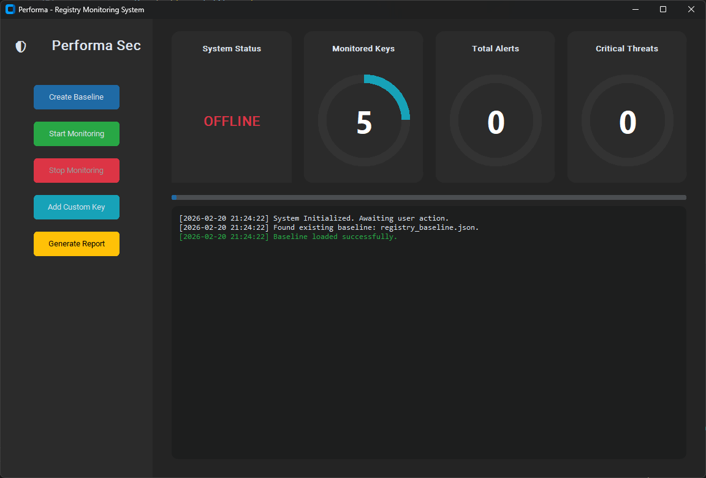

# 🛡️ Performa Sec: Windows Registry Change Monitoring System



## 📖 Project Overview
This project is a Blue Team cybersecurity toolkit designed to track unauthorized or suspicious changes made to the Windows Registry. Malware often targets the registry to maintain persistence or disable security tools. This system provides real-time monitoring, integrity checking via baseline comparisons, and automated PDF reporting to detect these threats.

## ✨ Features
* **Registry Integrity Checker:** Captures a baseline registry snapshot and compares current states to detect additions, deletions, and value modifications.
* **Autorun Key Monitoring:** Actively monitors `Run` and `RunOnce` persistence mechanisms in both HKCU and HKLM.
* **Malware-Like Change Detection:** Automatically flags critical threats, such as executables running from `Temp`/`AppData` folders or attempts to disable Windows Defender.
* **Modern GUI Dashboard:** Built with `customtkinter` featuring real-time animated gauges, alert counters, and a dark/light mode toggle.
* **Professional PDF Reporting:** Compiles session logs and critical malware incidents into a structured PDF document for forensic analysis.

## 🚀 Installation & Setup
**Prerequisites:** Windows OS and Python 3.8+

1. Clone the repository:
   ```bash
   git clone [https://github.com/akshatcore/Windows-Registry-Monitor.git](https://github.com/akshatcore/Windows-Registry-Monitor.git)
   cd Windows-Registry-Monitor
   Install the required dependencies:

2.Bash
  pip install -r requirements.txt
